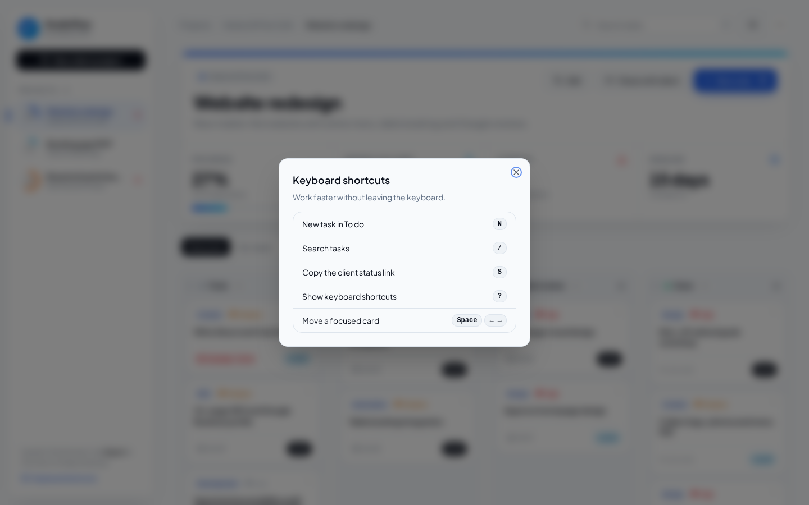

<div align="center">

# StudioFlow

**Client projects without the status-update emails.**

A project board and client portal for agencies, studios and freelancers. Run every client job on one board, see at a glance who's holding things up, and send clients a live status page as a single link.


</div>

## The problem it solves

Client work rarely stalls because of the work itself. It stalls while you wait on copy, logos or approvals, and the client often doesn't know they're the blocker. Then "where are we at?" turns into a long email thread.

StudioFlow makes ownership visible. Every task is marked as **Team** (you're on it) or **Client** (waiting on them), and one click turns the project into a clean, read-only status page the client can open without an account.

## Features

**Board**
- One board per client project: To do, In progress, Client review, Done
- Drag and drop with mouse, touch or keyboard (Space to pick up, arrows to move), with screen-reader announcements
- Cards show type, priority flag, due date and a Team/Client owner badge. Overdue dates turn red.
- Search, a Team/Client segmented filter and a priority filter
- Empty lanes explain what to do next

**Project overview**
- Project hero with the client, scope and a stat strip: progress, waiting on client, overdue and days to deadline
- Sidebar with a progress ring and overdue counter for every project

**Client status page**
- **Share with client** copies a link to a branded, read-only page: overall progress, deadline, "Waiting on you", in progress and completed
- The snapshot is compressed into the link itself, so it works on static hosting with no database or login
- Links are schema-checked when opened, so a truncated or edited link shows a friendly message instead of a broken page

**Keyboard first**
- `N` new task, `/` search, `S` copy the client link, `?` shortcut list
- Shortcuts are ignored while you type and never override browser shortcuts

**Your data**
- Saved in the browser and restored on reload
- JSON export and import. Imports are validated, size-limited and never overwrite existing projects.
- Create, edit and delete projects (client, scope, deadline, colour) and tasks (details, status, owner, priority, type, due date), with inline validation
- Due dates are stored as calendar days, so a deadline is the same day in every time zone

## Screenshots

| Client status page | Keyboard shortcuts |
| --- | --- |
|  |  |
| **Task editor** | **Dark mode** |
|  |  |

<p align="center"></p>

The clients and projects in the demo are fictional sample data.

## Design

- **Palette:** blue on white with black ink, plus a deep navy dark mode
- **Type:** Plus Jakarta Sans, self-hosted
- **Layout:** floating sidebar, breadcrumb header, a project hero with a gradient edge and an inline stat strip, and soft lanes with lifted cards

## Tech stack

| Area | Tools |
| --- | --- |
| App | React 19, TypeScript 5.9, Vite 7 |
| Drag and drop | dnd-kit (pointer, touch and keyboard sensors) |
| UI | Tailwind CSS v4, Radix primitives, Lucide icons |
| State | Zustand with versioned `localStorage` persistence |
| Validation | Zod (backups and share links) |
| Sharing | lz-string compressed snapshots in the URL hash |
| Quality | Vitest, Testing Library, ESLint 9, GitHub Actions CI |

```
src/
  lib/
    board.ts        # pure board logic: immutable moves, stats, filters, date helpers
    share.ts        # snapshot encode/decode with validation
    shortcuts.ts    # keyboard shortcut mapping
    store.ts        # persisted store, safe JSON import
    types.ts        # schemas for projects, tasks and columns
  components/       # board, cards, dialogs, client status page
```

Moving a card never mutates state and never computes a negative index when a card is dropped above the first one. Board logic, sharing, shortcuts and the store have unit tests, and the main flows have component tests.

## Run locally

You need Node.js 20+ (npm comes with it).

```bash
git clone https://github.com/gabrielolarinre74-pixel/studioflow.git
cd studioflow
npm install
npm run dev
```

Open http://localhost:5173.

**Demo mode.** Three sample client projects load on first visit, so the board, stats and client page all have something to show. Changes stay in your browser. **⋯ → Reset demo data** starts over.

Other commands:

```bash
npm test          # unit and component tests
npm run lint
npm run build     # static site in dist/
npm run preview   # serve the build
```

No environment variables or API keys are needed (see `.env.example`).

## Hosting

The build is a static site that runs on Vercel, Netlify, Cloudflare Pages, S3 or any static host, with no rewrites needed. CI (`.github/workflows/ci.yml`) lints, tests and builds every push. A GitHub Pages workflow is included but turned off, and only runs if started by hand.

## Roadmap

- Optional Supabase backend for always-current client links and team accounts
- Client approvals straight from the status page
- Weekly email digest of overdue and waiting-on-client tasks

## License

MIT. See [LICENSE](LICENSE).

---

Designed and developed by **Gabriel Zion** · [Gabriel.ATH](https://gabrielzion-portfolio.vercel.app). Websites, apps, automation and UI/UX for growing businesses.
