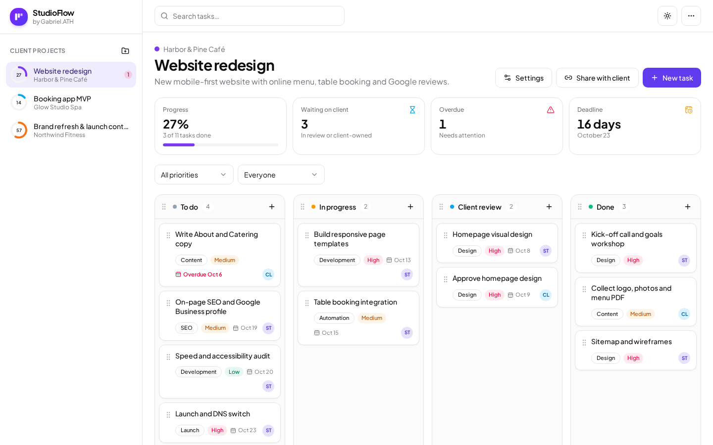
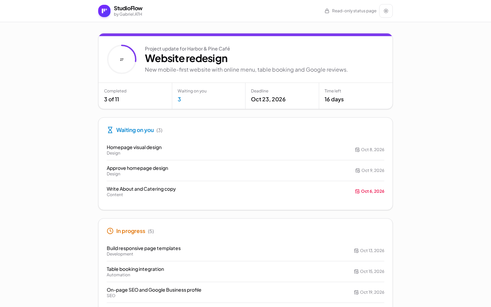
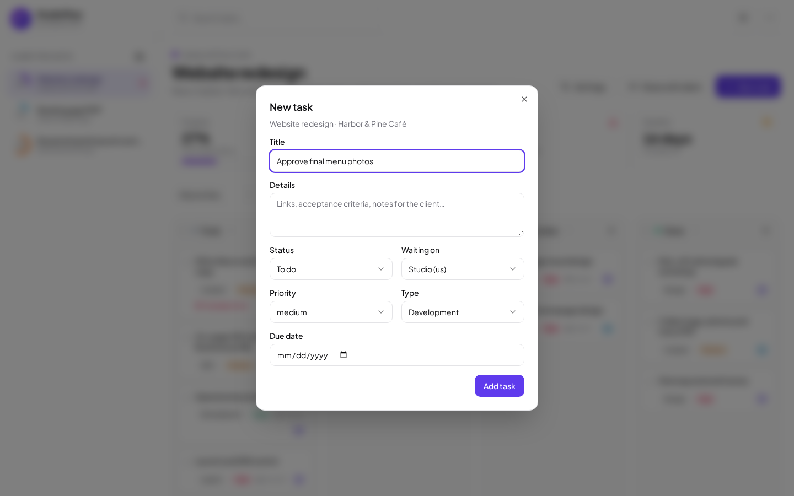
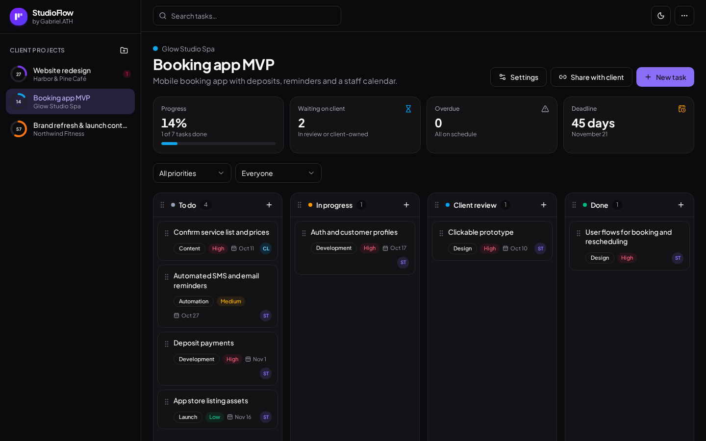
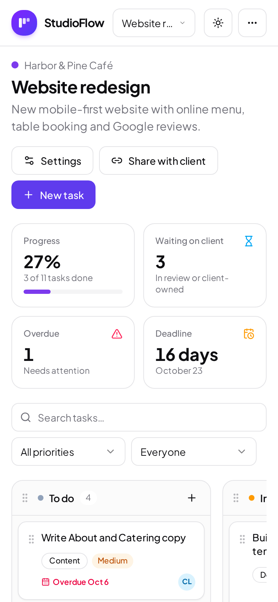

# StudioFlow

**Client project tracker and status portal for agencies, studios and freelancers.**

Client work usually stalls in the same place: the studio is waiting on content or approvals, the client doesn't know what is expected of them, and status updates turn into long email threads. StudioFlow keeps every client project on a drag-and-drop board, makes it obvious who each task is waiting on, and lets you send the client a **read-only status page as a single link**. The client doesn't need an account, and there is no server to run.

**Live demo:** https://gabrielolarinre74-pixel.github.io/studioflow/



## Features

### Project board
- Multiple client projects, each with its own board (To do → In progress → Client review → Done)
- Drag and drop tasks between columns and reorder columns, with **mouse, touch and keyboard** support (Space to pick up, arrows to move) and screen-reader announcements
- Task cards show the type (Design, Development, Content, SEO, Launch, Automation), priority, due date and an owner badge: **ST** when the studio is on it, **CL** when it is waiting on the client
- Overdue tasks are highlighted in red
- Search, plus priority and owner filters ("show me everything waiting on the client")

### Project health at a glance
- Progress ring for every project in the sidebar, plus an overdue counter
- Stat cards for progress, tasks waiting on the client, overdue tasks and days left until the deadline

### Client status page (share link)
- **Share with client** copies a link that opens a clean, read-only status page with progress, deadline, **"Waiting on you"**, in-progress and completed work
- The project snapshot is compressed into the link itself (`lz-string`), so it works on static hosting with no database and no login
- Links are validated with a strict schema when opened. Tampered or truncated links show a friendly error instead of breaking the page.

### Data you own
- Everything is saved in the browser (`localStorage`) and restored on reload
- **Export and import JSON backups**. Imports are schema-validated, size-limited and never overwrite existing projects.
- Create, edit and delete projects (name, client, scope, deadline, colour) and tasks (title, details, status, owner, priority, type, due date) with inline validation

### Polish
- Light and dark themes, responsive layout with a project switcher on mobile
- Due dates are handled as local calendar days, so "Oct 23" is the same day in every time zone

| Client status page | Task editor |
| --- | --- |
|  |  |
| **Dark mode** | **Mobile** |
|  |  |

## Tech stack

- **React 19 + TypeScript 5.9**, built with **Vite 7**
- **dnd-kit** for accessible drag and drop
- **Tailwind CSS v4**, Radix UI primitives and shadcn/ui-style components
- **Zustand** (persist middleware) for state
- **Zod** for data validation (backups and share links)
- **Vitest** + Testing Library + jsdom
- **GitHub Actions**: lint, test, build and deploy to GitHub Pages

## How it's built

```
src/
  lib/
    types.ts         # zod schemas: Project, Task, Column
    board.ts         # pure board logic: immutable moveTask, stats, filters, date helpers
    share.ts         # encode/decode read-only snapshots for client links
    store.ts         # persisted Zustand store (projects, tasks, import/export)
    sample-data.ts   # fictional demo projects
  components/
    KanbanBoard.tsx  # dnd-kit context, sensors, a11y announcements
    BoardColumn.tsx, TaskCard.tsx, TaskDialog.tsx, ProjectDialog.tsx
    ShareView.tsx    # the client-facing status page
```

Drag logic lives in `moveTask()`, a pure function that never mutates state and never computes a negative index when a task is dropped above the first card. Board, share-link and store behaviour is covered by unit tests, and the main flows (rendering the board, validating the task form, opening share links) are covered by component tests.

## Getting started

```bash
npm install
npm run dev       # http://localhost:5173
npm test          # unit + component tests
npm run build     # production build in dist/
```

No environment variables or API keys are needed. See `.env.example`.

## Roadmap

- Optional Supabase backend for live, always-up-to-date client links and team accounts
- Client approvals straight from the status page
- Email digests of overdue and waiting-on-client tasks

## License

MIT. See [LICENSE](LICENSE).

---

Designed and developed by **Gabriel Zion** · [Gabriel.ATH](https://gabrielzion-portfolio.vercel.app). Websites, apps, automation and UI/UX for growing businesses.

The demo projects and client names are fictional sample data.
